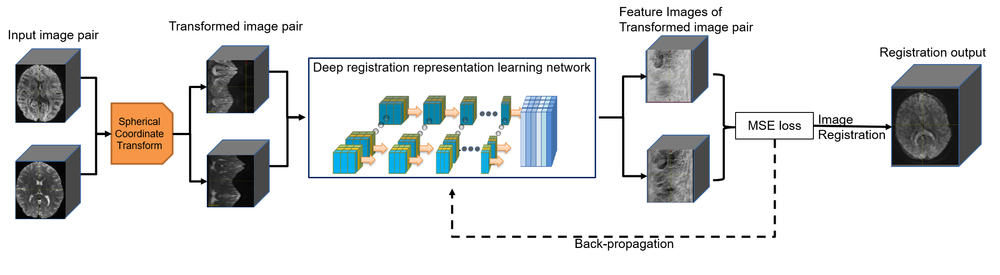

# Discriminative Representation Learning for Rigid Registration of diffusion-weighted MR Images


## Table of Contents

- [Abstract](#security)
- [Datasets](#security)
- [Getting Started](#security)

## Abstract

Head motion correction is a critical step in the current mainstream preprocessing pipelines for diffusion-weighted MRI (dMRI), and it can be considered a rigid registration problem for diffusion image volumes of varied b-values and gradient directions, differing drastically in their appearances. In addition, the dMRI images often contain severe susceptibility and eddy current induced distortions. Hence, it is difficult to define an optimal registration cost function for all volumes of a dMRI image. This problem can be alleviated by alternatingly and iteratively performing distortion correction and rigid registration with template learning, e.g. in the HCP diffusion preprocessing pipeline, though at a large cost of computation time. In this work, we propose a deep learning based method for learning the discriminative features for dMRI image registration. The registered images can then be fed to susceptibility distortion correction and eddy current distortion correction algorithms to produce the final preprocessed images in one shot, which significantly reduce the preprocessing time cost. By adopting a training loss defined by the feature-wise difference, the learned network produces image features that maximizes the feature-wise differences for misaligned samples while minimizing the differences for well aligned samples. The experimental results show that our method outperforms the training alignment examples for dMRI image preprocessing, and achieves similar results of the HCP pipeline at significantly reduced time cost. 

## Datasets
We adopt the diffusion MRI data from the the Human Connectome Project(HCP) Young Adult 1200 Release. Image pairs in the dataset are 3D images volume by volume and have the same file name. The example data could be downloaded from [here](https://drive.google.com/drive/folders/16UrpjpNGjrFz1n1AYTXhyXI5NHBiUFeK?usp=sharing). The data set should be organized as:

    |--data
        |--train
            |--moving_images
                |--a_pos0.nii.gz
                |--b_neg0.nii.gz
                '''
            |--fixed_images
                |--a_pos0.nii.gz
                |--b_neg0.nii.gz
                '''
            |--training_data_augmentation_parameters.csv
        |--valid
          '''
        |--test
          '''

## Getting Started
### Requirements
This is an example of how you may give instructions on setting up your project locally.
To get a local copy up and running follow these simple example steps.

1. Clone the repo
```
git clone https://github.com/chujie-zhang/DeepRegRepdMRI.git
```
2. The framework is tested on machines with the following environment:
- Python >= 3.6
- CUDA >= 10.0

To install dependencies, please run the following command:
```
pip3 install -r requirement.txt
```


## Training
```
python train.py --device cuda:1 \
               --epochs 50 \
               --lr 5*1e-07 \
               --train_batch 64\
               --valid_vatch 16\
               --log 1\
               --train_path ./data/train \
               --valid_path ./data/valid \
               --pos_weight 4 \
               --neg_weight -20
 ```
## Evaluation
```
python test.py --device cuda:1 \
               --test_path ./data/test \
               --checkpoints ./network/pretrain.pt \
               --save_path ./inference/
 ```
 ## Contact
 If you have any questions, please post through github issue, or contact zhangcj@zhejianglab.com.
